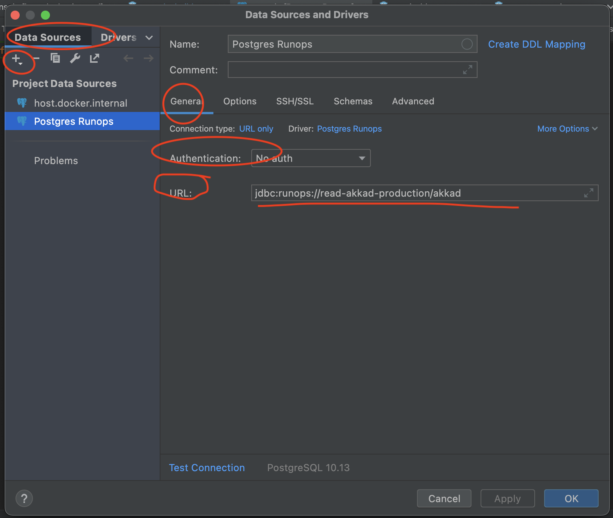

# Runops JDB

## Install step by step

### 1. Generating or Downloading doJAR file

### 2. Runops open session

First off all, You have to have installed `node`, You can check it running it `node -v`

`sudo npm install -g runops`

` runops signup`

I have to fill your corporate Ebanx e-mail like myemail@ebanx.com

A browser session will open, You have to do sign

Back to command terminal and stop the runops process `control+c`

### 3. IDE Configuration
<ul>
  <li>1. Data Sources and Drivers</li>
    <ul>
      <li>1.1. In left panel side </li>
        <ul>
          <li>1.1.1. click in `Drivers` tab</li>
          <li>1.1.2. click in icon `+`</li>
        </ul>
      <li>1.2. In right panel side</li>
        <ul>
          <li>1.2.1. In Driver File click in icon `+` and choose file jar downaloed ou generated before</li>
          <li>1.2.2. In Name set `Postgres Runops`</li>
          <li>1.2.3. In General->Class, choose: `ninja.ebanx.runops.Driver`</li>
          <li>1.2.4. In Options->Others [Icon, Dialect] choose: `PostgresSQL`</li>
          <li>1.2.5. In Advanced->VM home path choose: `...../Library/Java/JavaVirtualMachines/openjdk-18.0.1.1/Contents/Home` </li>
          <li>1.2.6. Click in `Applay` button</li>
        </ul>
     </ul>
  <li>2. click in `Data Sources` tab</li>
      <ul>
        <li>2.1. click in icon `+`</li>
        <li>2.2. You have to choose `User Driver->Postgres Runops` </li>
        <li>2.3. In General->Authentication choose: `no auth`</li>
        <li>2.4. In General->URL set: `jdbc:runops://read-akkad-production/akkad`</li>
        <li>2.5. Click in `Ok` button</li>
      </ul>
</ul>

